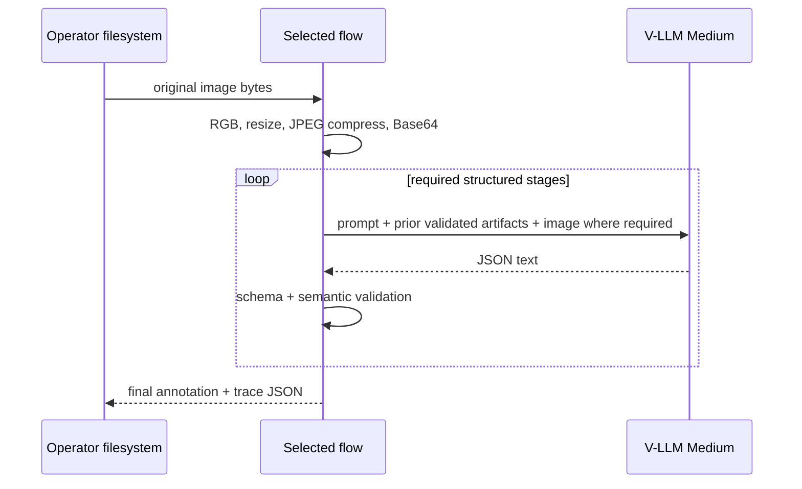

# AI architecture

## Use cases and exclusions

The only AI use case is generation of person-image annotations for manual viewing:
a factual caption and 21 taxonomy-constrained attributes (FR-002–009). Five flows
explore progressively more structured generation, consensus, and self-correction.

Excluded now: benchmark evaluation, learned scoring, quality/confidence metrics,
automatic production acceptance, RAG, embeddings, STT/TTS, moderation services,
agents with tools, and training/fine-tuning.

## Model and serving boundary

The user selected the existing remote `v-llm-v1-medium` service (BR-001). The
packages do not host, scale, or batch the model. They use C1's OpenAI-compatible
Chat Completions and OAuth contract. Alternative local models or Large are not
selected in this phase.

Each request uses structured output, thinking disabled, temperature 0 by default,
and a bounded token setting. G3 gains diversity through four explicit observer
instructions (whole-body inventory, clothing/colors/pattern, accessories/carried
items, and visibility/uncertainty) instead of relying on an undocumented seed.

## End-to-end data and privacy flow

Images cross the external provider trust boundary. Prior stage artifacts are sent
only when required by the next stage. Caption-only synthesis in G2 receives facts
without the image. No provider request or response is cached on disk.

## Orchestration by flow

### G1 direct annotation

One vision call returns `{caption, attributes}`. It is the strongest simple
baseline and matches C1 behavior with a richer trace envelope.

### G2 facts then caption

1. Vision analysis enumerates visible evidence and uncertainty.
2. Fact normalizer sees image + analysis and returns canonical facts and all
   attributes.
3. Caption generator sees canonical facts only and produces one concise sentence.

The final attributes come only from stage 2; the caption cannot change them.

### G3 four-observer consensus

Four vision calls independently return full candidate annotations under different
evidence-focus prompts. A fifth vision call receives image + candidates and returns
all final attributes plus support indices per field. A sixth text-only call writes
the caption from final attributes and selected visible facts. The consensus schema
does not expose a score.

### G4 generator, critic, verifier

Generator produces a full draft. Critic sees image + draft and lists concrete
unsupported, missing, or taxonomy-inconsistent claims. Verifier independently
sees image, draft, and critique and chooses accept/reject with reasons. Reject feeds
issues into regeneration. Proposed maximum: three generator attempts. If no draft
is accepted, the run fails with `WorkflowExhaustedError`; it does not label the
latest rejected draft as final.

### G5 question/answer refinement

A full draft is produced. A question generator converts caption claims and
attribute choices into bounded, uniquely identified verification questions. An
image-grounded answer stage answers only those questions. A comparator returns
accept or a complete corrected annotation. A refined draft begins the next round.
Proposed maximum: two refinement rounds. Exhaustion fails rather than publishing a
non-accepted draft.

## Prompt and contract versioning

Each package keeps prompts as pure named functions and defines a `PROMPT_VERSION`
included in its trace artifacts. JSON Schemas are code-generated from the vendored
taxonomy; stage responses reject extra keys. Prompt text explicitly prohibits
identity, relationship, intent, location, and occluded-detail inference. Context is
bounded by maximum list/string sizes and the existing `max_tokens` setting.

## Safety and data leakage controls

- No arbitrary user text enters prompts; inputs are image bytes and validated prior
  artifacts, reducing prompt-injection surface.
- Text seen inside an image is treated as visual evidence, never as instructions.
- Intermediate JSON is serialized before embedding in the next prompt and labeled
  untrusted model output.
- Secrets/provider bodies/image data URLs are excluded from logs and outputs.
- The system avoids sensitive identity inference, but the image itself may still be
  personal data; governance is unresolved in OQ-003.

## Reliability, fallback, and cost

Transport retries and token refresh follow C1. Schema-invalid model output fails
the stage. There is no cross-model fallback because only V-LLM Medium was requested
and fallback semantics could invalidate comparisons. Loop limits cap runaway cost.
Call counts are documented in system architecture. Provider concurrency, token
prices, budgets, and latency targets remain unknown (OQ-004).

## Evaluation and human review

No AI evaluation implementation is included now, per the confirmed scope. The
operator manually views `final` and `trace`. Critic, verifier, consensus, and Q&A
steps are internal generation mechanisms and emit no evaluation metrics.

A later evaluation phase should introduce a frozen image set and human labels,
then compare identical final contracts across flows using caption and per-attribute
metrics. Thresholds, release gates, drift monitoring, and feedback ingestion are
explicitly deferred until that phase is requested.

