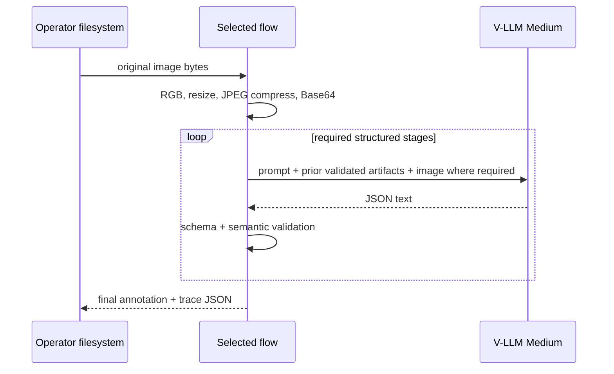

# AI architecture

## Use cases and exclusions

The only AI use case is generation of person-image annotations for manual viewing:
a factual caption and 21 taxonomy-constrained attributes (FR-002–009). Five flows
explore progressively more structured generation, consensus, and self-correction.

Excluded now: benchmark evaluation, learned scoring, quality/confidence metrics,
automatic production acceptance, RAG, embeddings, STT/TTS, moderation services,
agents with tools, and training/fine-tuning.

## Model and serving boundary

The user selected the existing remote `v-llm-v1-medium` service (BR-001). The
packages do not host, scale, or batch the model. They use C1's OpenAI-compatible
Chat Completions and OAuth contract. Alternative local models or Large are not
selected in this phase.

Each request uses structured output, thinking disabled, temperature 0 by default,
and a bounded token setting. G3 gains diversity through four explicit observer
instructions (whole-body inventory, clothing/colors/pattern, accessories/carried
items, and visibility/uncertainty) instead of relying on an undocumented seed.

## End-to-end data and privacy flow

Images cross the external provider trust boundary. Prior stage artifacts are sent
only when required by the next stage. Caption-only synthesis in G2 receives facts
without the image. No provider request or response is cached on disk.

## Orchestration by flow

### G1 direct annotation

One vision call returns `{caption, attributes}`. It is the strongest simple
baseline and matches C1 behavior with a richer trace envelope.

### G2 facts then caption

1. Vision analysis enumerates visible evidence and uncertainty.
2. Fact normalizer sees image + analysis and returns canonical facts and all
   attributes.
3. Caption generator sees canonical facts only and produces one concise sentence.

The final attributes come only from stage 2; the caption cannot change them.

### G3 four-observer consensus

Four vision calls independently return full candidate annotations under different
evidence-focus prompts. A fifth vision call receives image + candidates and returns
all final attributes plus support indices per field. A sixth text-only call writes
the caption from final attributes and selected visible facts. The consensus schema
does not expose a score.

### G4 generator, critic, verifier

Generator produces a full draft. Critic sees image + draft and lists concrete
unsupported, missing, or taxonomy-inconsistent claims. Verifier independently
sees image, draft, and critique and chooses accept/reject with reasons. Reject feeds
issues into regeneration. Configured default maximum: 20 generator attempts. If no draft
is accepted, the run fails with `WorkflowExhaustedError`; it does not label the
latest rejected draft as final.

### G5 question/answer refinement

A full draft is produced. A question generator converts caption claims and
attribute choices into bounded, uniquely identified verification questions. An
image-grounded answer stage answers only those questions. A comparator returns
accept or a complete corrected annotation. A refined draft begins the next round.
Configured default maximum: 20 refinement rounds. Exhaustion fails rather than publishing a
non-accepted draft.

## Prompt and contract versioning

Each package keeps prompts as pure named functions and defines a `PROMPT_VERSION`
included in its trace artifacts. JSON Schemas are code-generated from the vendored
taxonomy; stage responses reject extra keys. Prompt text explicitly prohibits
identity, relationship, intent, location, and occluded-detail inference. Context is
bounded by maximum list/string sizes and the existing `max_tokens` setting.

## Safety and data leakage controls

- No arbitrary user text enters prompts; inputs are image bytes and validated prior
  artifacts, reducing prompt-injection surface.
- Text seen inside an image is treated as visual evidence, never as instructions.
- Intermediate JSON is serialized before embedding in the next prompt and labeled
  untrusted model output.
- Secrets/provider bodies/image data URLs are excluded from logs and outputs.
- The system avoids sensitive identity inference, but the image itself may still be
  personal data; governance is unresolved in OQ-003.

## Reliability, fallback, and cost

Transport retries and token refresh follow C1. Schema-invalid model output fails
the stage. There is no cross-model fallback because only V-LLM Medium was requested
and fallback semantics could invalidate comparisons. Loop limits cap runaway cost.
Call counts are documented in system architecture. Provider concurrency, token
prices, budgets, and latency targets remain unknown (OQ-004).

## Evaluation and human review

No AI evaluation implementation is included now, per the confirmed scope. The
operator manually views `final` and `trace`. Critic, verifier, consensus, and Q&A
steps are internal generation mechanisms and emit no evaluation metrics.

A later evaluation phase should introduce a frozen image set and human labels,
then compare identical final contracts across flows using caption and per-attribute
metrics. Thresholds, release gates, drift monitoring, and feedback ingestion are
explicitly deferred until that phase is requested.

## Review workspace boundary

The spreadsheet review workspace contains no AI/evaluator/judge/metric. It only
places current golden data beside existing predictions in a workbook for operator
inspection. The separate evaluator below is an optional JSONL-producing package.

## Gemini multimodal judge

For each successful prediction, Gemini receives the exact query image, the matching
human-labeled `attributes.tsv` row, generated caption/attributes, and the caption
and attribute rubrics. It must return structured caption Level 0–3, claim errors,
21 field verdicts, and `needs_human_review`. The image remains final visual
evidence when a label and crop conflict.

The official Python SDK is `google-genai`. Gemini supports image multimodal input
and structured JSON, but its schema is only a supported subset and Google advises
application-side validation; local validation is therefore mandatory. The exact
model defaults to `gemini-2.5-pro` and remains configurable as `GEMINI_MODEL`.
Provider references:
[image understanding](https://ai.google.dev/gemini-api/docs/image-understanding)
and [structured output](https://ai.google.dev/gemini-api/docs/structured-output).

The judge is stateless `models.generate_content`, not an agent. Image bytes and
golden attributes cross the Gemini trust boundary. No raw image data, API key, or
raw response is logged; judge output never modifies source data.

## Dashboard boundary

The local image-lookup dashboard uses no AI component. It only renders the existing
image path established from dataset metadata. This separation prevents a visual
inspection aid from changing model outputs, invoking a model, or inferring an image
identity from its pixels.

## Human review extension boundary

The editable dashboard adds no AI call or new judgment model. It displays stored
Gemini review evidence and records an explicitly human-labeled override. The export
shows machine and human values separately, so no manual action is fed into prompt
generation, Gemini evaluation, or golden-label mutation.

## Factuality-first Gemini evaluator v2 (proposed)

The evaluator remains one stateless multimodal Gemini call, not an agent: input is
the exact image, generated English caption, 21 generated attributes, and matching 21
golden attributes. It judges claims actually made by the caption—not how much of the
image the caption covers. For each taxonomy field it returns whether the caption
mentions it; omission yields `mentioned=false, is_correct=null`. A separate
unmapped-claim list captures non-taxonomy claims such as person count.

Generated attributes are judged separately as true/false/null against image and
golden evidence. Null means evidence is insufficient/conflicting, never a failure.
Prompt version becomes `gemini_factuality_v2_vi`; provider JSON-schema enforcement
is followed by local semantic validation. Metrics are caption factuality pass rate,
evaluated-claim accuracy, mention coverage, attribute accuracy, and unresolved rate;
coverage is descriptive only.

This is a judge-contract replacement only. The evaluator consumes persisted G1–G5
results and never invokes a generator or writes into a G-flow output folder.

### V2 review consumers

Dashboard and Excel are passive local consumers of validated Gemini v2 JSONL. They
never invoke Gemini, V-LLM, or a judge. A human overlay is provenance separate from
AI evaluation, so corrections cannot affect prompt context, scoring, or source
predictions in a later evaluator run.

### Isolated factuality judgments (proposed)

Caption factuality is image-plus-caption claim grounding; golden labels and generated
attributes are excluded to avoid leaking taxonomy expectations. Attribute verification
is a separate image-plus-reference comparison. This doubles normal judge calls but
gives caption true/false a clear meaning.

## Two independent evaluator products v3 (approved)

The evaluator will use two stateless Gemini calls per persisted prediction:

1. **Caption factuality** receives only image plus English caption. Its boolean says
   whether the caption makes any unsupported or contradicted visual claim. It does
   not measure completeness.
2. **Caption-to-golden attribute matching** receives only English caption plus the
   exact golden 21-field object. It extracts which taxonomy claims the caption makes
   and labels each mentioned claim true/false/null. This is a reference-consistency
   product, not an image judge.
All prompts require Vietnamese notes and strict JSON. A local validator owns the
21-field set and tri-state rules. The two results are stored side by side without
cross-branch aggregation. Generated structured attributes remain read-only prediction
provenance and are not scored in this evaluator version.

Method-specific Excel workbooks are presentation artifacts only. They expose the
caption factuality branch and all caption-to-golden attribute checks but do not call
Gemini or feed values back to a generator or judge.

## G3–G5 code-level flow reference

[`g3_g5_flow_implementation_guide.md`](g3_g5_flow_implementation_guide.md)
documents the exact observed Python orchestration, in-memory state, prompts,
structured outputs, retries, and call-count bounds for G3, G4, and G5.

## Generation observability

Each VLLM client tracks per-case request count and provider-reported usage at the
client boundary. It does not score, rank, select, or alter generated annotations.
The final prediction receives `input_token`, `output_token`, `num_request`,
`num_retry`, and `num_error_request`; tokens remain `null` when the provider does
not return `usage` (OQ-023).
