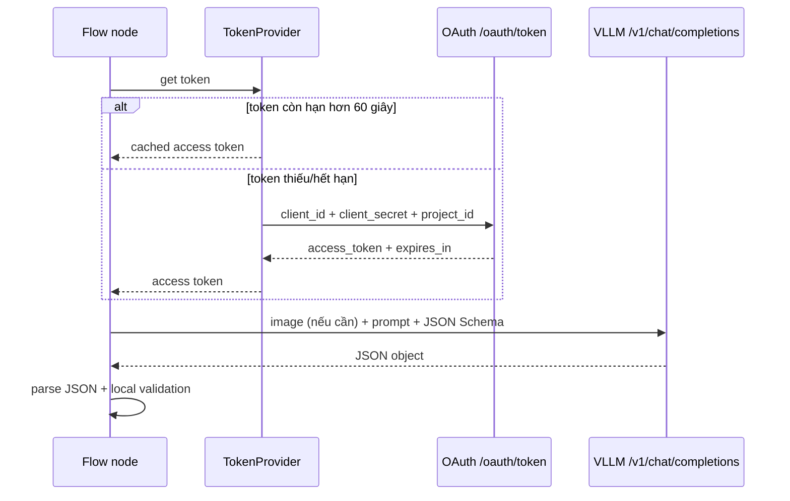
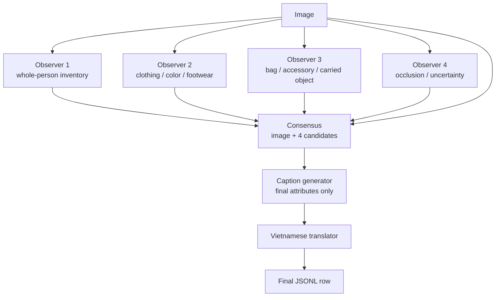
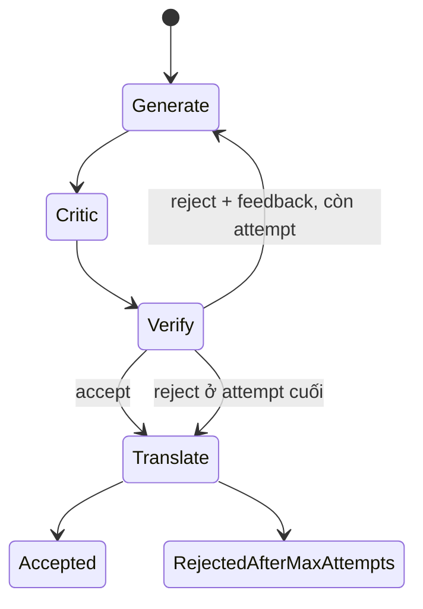
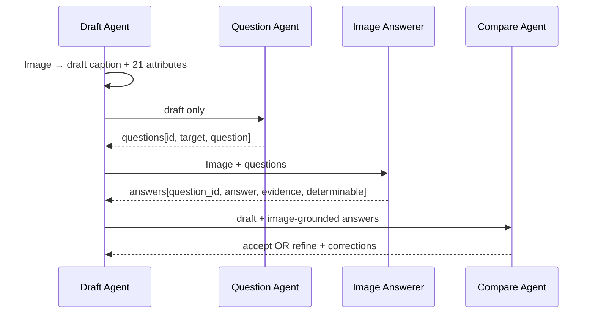
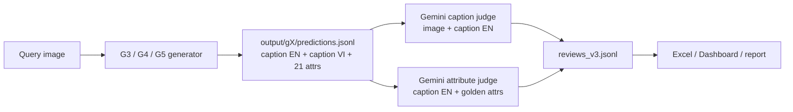

# Hướng dẫn triển khai chi tiết G3, G4 và G5

> Phạm vi: tài liệu này mô tả **đúng code đang có trong repository** tại thời điểm viết, không phải kiến trúc dự kiến. Nó chỉ giải thích ba luồng sinh annotation G3–G5; AI Harness/Gemini evaluation là hệ thống downstream riêng.

## 1. Mục đích và cách đọc tài liệu

Mỗi luồng nhận **một ảnh người** và sinh ra cùng một kết quả chuẩn:

```json
{
  "caption": "English caption",
  "caption_vi": "Vietnamese translation",
  "attributes": { "...": "21 taxonomy fields" }
}
```

Khác biệt giữa G3, G4 và G5 là cách chúng kiểm tra trước khi trả kết quả:

| Luồng | Ý tưởng cốt lõi | Cách giảm lỗi |
|---|---|---|
| G3 | Nhiều lượt quan sát độc lập rồi đồng thuận | Không tin một lần quan sát duy nhất |
| G4 | Draft → Critic → Verifier → regenerate | Tìm lỗi trong draft và lặp sửa |
| G5 | Draft → Question → Answer from image → Compare → refine | Chuyển claim thành câu hỏi để kiểm chứng |

Trong tài liệu này, **model call** là một lần gọi `/v1/chat/completions` ở mức logic. Một model call có thể sinh nhiều HTTP request thật nếu gặp retry.

## 2. Thành phần chung của cả ba luồng

### 2.1. Input, taxonomy và output

Mỗi luồng đọc các `TestSample` gồm:

```text
sample_id
image_path
relative_image_path
```

Mọi annotation phải có đúng 21 trường taxonomy, theo thứ tự:

```text
age, gender, body_build,
upper_clothing_type, upper_clothing_color,
lower_clothing_type, lower_clothing_color,
clothing_style, upper_pattern,
footwear_type, bag_type, bag_color,
headwear, eyewear, face_mask, other_accessories,
hair_length, hair_texture, hairstyle, hair_color,
carried_objects
```

`attribute_schema.json` quy định code hợp lệ của từng trường. Trường single-label nhận một code hợp lệ hoặc `null`; trường multi-label nhận mảng code không trùng hoặc `null`. Local validator kiểm tra đủ 21 key, không có key thừa và giá trị phải thuộc taxonomy trước khi workflow chuyển sang node tiếp theo.

Output được ghi từng dòng vào `output/g3/predictions.jsonl`, `output/g4/predictions.jsonl` hoặc `output/g5/predictions.jsonl`. Main thread flush và `fsync` ngay khi worker hoàn thành một ảnh, nên worker xong trước sẽ được ghi trước; file không phụ thuộc thứ tự input.

### 2.2. Gọi VLLM chung

Mỗi package có `VllmClient` riêng nhưng logic gần như giống nhau:



Chi tiết payload model:

- Model mặc định: `v-llm-v1-medium`.
- Endpoint: `{VLLM_BASE_URL}/v1/chat/completions`.
- `temperature=0`, `stream=false`, `max_tokens=VLLM_MAX_TOKENS` (mặc định 1024).
- `response_format.type=json_schema`; model phải trả JSON đúng schema node yêu cầu.
- Node có ảnh gửi `image_url` chứa JPEG Base64; ảnh được convert RGB, thu nhỏ tối đa 1280×1280 và nén xuống tối đa 60 KB.
- `VLLM_ENABLE_THINKING=true` mặc định. Riêng node dịch tiếng Việt gửi `enable_thinking=false`.

### 2.3. Retry và lỗi HTTP

Một node call có retry transport tối đa `VLLM_MAX_RETRIES` lần, mặc định 3 **lần gọi tổng cộng**, không phải 3 lần cộng thêm. Các status retryable là `408, 409, 429, 500, 502, 503, 504`; network error cũng retry. Backoff là `0.5 × 2^attempt` giây, tối đa 8 giây, hoặc dùng `Retry-After` tối đa 30 giây.

- `401`: token bị invalidate, flow lấy token mới rồi thử lại nếu còn attempt.
- HTTP 4xx/5xx không retry được: node thất bại.
- JSON không parse được hoặc không qua local validation: node thất bại. G5 có thêm retry validation riêng, mô tả ở phần G5.

### 2.4. Concurrency, state và “agent”

Các hàm có tên `observer_agent`, `critic_agent`, `answer_agent` chỉ là wrapper gọi model. Không có `AgentExecutor`, `LangChain Agent`, `LangGraph` hay tool-calling loop.

```text
--workers 3
    ├─ Worker A: xử lý trọn vẹn ảnh 001 theo G4
    ├─ Worker B: xử lý trọn vẹn ảnh 002 theo G4
    └─ Worker C: xử lý trọn vẹn ảnh 003 theo G4
```

- `--workers` chạy **nhiều ảnh**, không gửi ba ảnh trong một request.
- Bên trong một ảnh, node của G3/G4/G5 chạy tuần tự vì node sau cần output node trước.
- `VllmClient` và token cache được dùng chung trong process; `TokenProvider` có lock để tránh nhiều worker refresh token cùng lúc.
- Memory chỉ là biến Python của một run: `candidates` (G3), `feedback`/`last_draft` (G4), `corrections`/`questions`/`answers` (G5). Khi process kết thúc, memory mất. JSONL chỉ giữ final result và một phần workflow status, không giữ full trace node-by-node.

### 2.5. Dataset mapping hiện tại cần lưu ý

Code `g3_consensus_annotation/dataset.py`, `g4_critic_verifier/dataset.py` và `g5_qa_refinement/dataset.py` hiện đọc:

```text
sample/test/pairs_en_medium.tsv
sample/test/attributes.tsv
```

Chúng lọc `is_query=1` từ `pairs_en_medium.tsv`, rồi kiểm tra `person_id` có trong `attributes.tsv`. Tuy nhiên, thư mục `sample/test` hiện quan sát được chỉ có `attributes.tsv` và `identities.tsv`, không có `pairs_en_medium.tsv`. Vì thế **code generator hiện tại sẽ dừng ở bước load dataset nếu chạy lại nguyên trạng**. Đây là mismatch implementation/dataset; không phải hành vi runtime mong muốn và cần sửa mapping sang manifest hiện hành trước lần generate tiếp theo.

AI Harness evaluation không dùng file này; nó dùng `output/review/captions_merged.csv` để map `sample_id → image_path`.

## 3. G3 — Four-run consensus

### 3.1. Mục tiêu

G3 cố gắng giảm lỗi do một lần nhìn ảnh bằng cách yêu cầu model quan sát cùng ảnh bốn lần với bốn trọng tâm khác nhau. Sau đó một call thứ năm nhận ảnh và bốn annotation để chọn attribute cuối; caption cuối được tạo từ attributes đã chọn.



### 3.2. State chuyển qua từng node

| Bước | Hàm code | Input | Có ảnh? | Output trong RAM | Được ghi JSONL ngay? |
|---|---|---|---|---|---|
| 1–4 | `observer_agent(index, ...)` | ảnh + prompt focus | Có | `{caption, attributes}` cho từng observer | Không |
| 5 | `consensus_agent(...)` | ảnh + `candidates[4]` | Có | `{attributes}` cuối | Không |
| 6 | `caption_agent(...)` | attributes cuối | Không | `{caption}` tiếng Anh | Không |
| 7 | `vietnamese_translation_agent(...)` | caption tiếng Anh | Không | `caption_vi` | Có, cùng final result |

Điểm quan trọng: bốn observer **không chạy song song trong cùng ảnh**. Code dùng list comprehension nên gọi observer 1 rồi 2 rồi 3 rồi 4. Chỉ nhiều ảnh mới song song khi tăng `--workers`.

### 3.3. Bốn observer thực sự được hỏi gì?

Mỗi observer nhận cùng image bytes, annotation JSON Schema và prompt chung “trả caption tiếng Anh medium-length + toàn bộ 21 attribute; không đoán chi tiết bị che”. Khác nhau ở trọng tâm:

1. Inventory toàn thân: tuổi biểu hiện, body, hair, outfit.
2. Clothing: loại/màu/họa tiết áo quần và footwear.
3. Bag/accessory: túi, headwear, eyewear, mask, phụ kiện, đồ mang theo.
4. Conservative pass: occlusion, uncertainty, không đoán.

Mỗi observer phải trả một caption và 21 attributes. Local `_annotation()` trim caption, giới hạn 500 ký tự, rồi `validate_attributes()` trước khi đưa result vào `candidates`.

### 3.4. Consensus và caption

Consensus call nhận **cả ảnh lẫn bốn candidate annotations**. Prompt nói candidates là quan sát không đáng tin tuyệt đối; model phải ưu tiên evidence từ ảnh và không gộp label mâu thuẫn nếu ảnh không hỗ trợ. Schema của consensus chỉ cho phép `{attributes}`.

Caption Generator không nhận ảnh, không nhận bốn observer captions. Nó chỉ nhận `final attributes` và viết caption 20–35 từ theo thứ tự age/gender → build → hair → upper clothing → lower clothing → footwear → bag/accessory. Vì vậy caption G3 phản ánh attributes sau consensus, không phải câu caption nào trong bốn observer.

### 3.5. Request count và failure

Không retry HTTP/validation:

```text
4 observer + 1 consensus + 1 caption + 1 translation = 7 logical model calls / image
```

Với `VLLM_MAX_RETRIES=3`, một logical call có thể tạo tối đa 3 HTTP attempts do transport. OAuth token refresh không xảy ra cho từng node nếu token còn hạn.

Nếu bất kỳ node nào lỗi, `generate_dataset()` của G3 bắt toàn bộ exception và ghi:

```json
{
  "status": "error",
  "error": {
    "code": "generation_failed",
    "message": "The image could not be annotated"
  }
}
```

Do đó G3 hiện che mất tên stage gốc ở JSONL; muốn benchmark/debug per-node cần thêm telemetry riêng ở `VllmClient.complete()`.

## 4. G4 — Generator → Critic → Verifier

### 4.1. Mục tiêu

G4 sinh một draft, yêu cầu một Critic tìm claim unsupported/missing/taxonomy-invalid, sau đó yêu cầu Verifier độc lập ra quyết định accept/reject. Reject đưa feedback quay lại Generator cho attempt tiếp theo.



### 4.2. State trong một ảnh

```python
feedback = None
last_draft = None
last_notes = []
```

Mỗi attempt thực hiện tuần tự:

| Node | Hàm | Input | Có ảnh? | Output |
|---|---|---|---|---|
| Generator | `generator_agent` | ảnh + `feedback` nếu trước đó reject | Có | `draft = {caption, attributes}` |
| Critic | `critic_agent` | ảnh + `draft` | Có | `issues[]` với `target`, `issue`, `suggested_correction` |
| Verifier | `verifier_agent` | ảnh + `draft` + `issues[]` | Có | `{decision: accept|reject, reasons[]}` |

Generator prompt yêu cầu caption 20–35 từ và 21 attributes; feedback được append vào prompt dưới dạng JSON. Critic được phép nêu:

- claim caption/attribute không được ảnh hỗ trợ;
- attribute không đúng taxonomy;
- omission material **chỉ khi chi tiết đó rõ ràng** trên ảnh.

Verifier không dùng score. Nó chỉ `accept` nếu caption và mọi attribute đã xác định đều được ảnh hỗ trợ; còn lại `reject` với lý do text.

### 4.3. Khi Verifier reject

Code tạo state cho round sau:

```python
feedback = critic_issues + [
  {
    "target": "verifier",
    "issue": verifier_reason,
    "suggested_correction": "Correct the unsupported claim."
  }
]
```

`last_notes` chứa critic issues và verifier reasons của **attempt reject cuối cùng**. Generator next attempt nhận feedback này, vẫn nhìn lại ảnh và tạo một draft mới hoàn toàn.

### 4.4. Kết thúc workflow

| Điều kiện | Final `workflow_status` | `workflow_notes` | Có caption_vi? |
|---|---|---|---|
| Verifier accept | `accepted` | `[]` | Có |
| Hết `max_attempts` nhưng vẫn reject | `rejected_after_max_attempts` | critic/verifier notes attempt cuối | Có |
| Node/HTTP/schema lỗi | JSONL `status=error` | không có final annotation | Không |

Đây là điểm dễ nhầm: code hiện tại **vẫn ghi last rejected draft là `status=success`** cùng `workflow_status=rejected_after_max_attempts`. README nói “Only accepted drafts are written”, nhưng câu đó không khớp implementation hiện tại.

`--max-attempts` CLI mặc định là 20. Nếu accept ở attempt đầu: `3 + 1 = 4` logical calls (Generator, Critic, Verifier, Translation). Nếu bị reject ở cả 20 attempt: `20 × 3 + 1 = 61` logical calls.

G4 có HTTP retry nhưng không có retry validation ở pipeline: một structured JSON invalid sau `VllmClient.complete()` sẽ kết thúc case. Lỗi được prefix stage, ví dụ `generator: ...`, `critic: ...`, `verifier: ...`.

## 5. G5 — Question-answer refinement

### 5.1. Mục tiêu

G5 không cho Critic review trực tiếp draft. Nó biến claim/uncertainty/omission của draft thành câu hỏi, yêu cầu model trả lời các câu hỏi chỉ bằng ảnh, rồi Compare node đối chiếu câu trả lời với draft để accept hoặc refine.



### 5.2. Node contract

| Node | Input | Có ảnh? | Output contract | Ý nghĩa |
|---|---|---|---|---|
| Draft | image + corrections trước đó | Có | `{caption, attributes}` | Sinh annotation đang được kiểm tra |
| Question | draft | Không | `questions[]` | Tạo câu hỏi về claim, uncertainty và omission |
| Answer | image + questions | Có | `answers[]` | Chỉ trả lời từ ảnh |
| Compare | draft + answers | Không | `accept/refine + corrections[]` | Router quyết định draft có qua không |
| Translate | caption EN | Không | `{caption_vi}` | Dịch output cuối |

Compare không nhìn ảnh trực tiếp. Nó tin evidence đi qua `answers[]`. Vì vậy quality của Answer node quyết định router có đủ evidence để accept/refine hay không.

### 5.3. Round và memory

`corrections` là memory duy nhất giữa các round:

```python
corrections = None
for round_index in range(max_refinements + 1):
    draft = Draft(image, corrections)
    questions = Question(draft)
    answers = Answer(image, questions)
    decision, corrections = Compare(draft, answers)
```

- Round đầu: `corrections=None`.
- Khi Compare trả `refine`, `corrections[]` được gửi vào draft prompt round tiếp theo.
- Khi Compare trả `accept`, draft hiện tại là final.
- `max_refinements=20` nghĩa là tối đa 20 lần refine **sau round đầu**, tức tối đa 21 round. Pipeline default khi gọi trực tiếp là 2, nhưng CLI override mặc định 20.

### 5.4. Validation nghiêm ngặt

Question list phải có ID duy nhất. Answer list phải trả đúng và đủ tập `question_id` của Question node; thiếu, thừa hoặc trùng ID làm case lỗi. Mỗi answer bắt buộc có:

```json
{
  "question_id": "q1",
  "answer": "...",
  "evidence": "...",
  "determinable": true
}
```

Prompt yêu cầu 3–12 questions, trong khi schema code cho phép 1–30 questions. Khi mô tả benchmark, nên lấy behavior prompt là kỳ vọng còn schema là giới hạn kỹ thuật.

G5 có thêm `_validated()` retry: nếu local schema/semantic validation fail, nó gọi lại toàn node tối đa hai lượt. Mỗi lượt node đó vẫn có HTTP retry trong `VllmClient`. Vì vậy số HTTP request thật của G5 có thể cao hơn logical call count đáng kể khi model trả JSON sai.

### 5.5. Kết thúc workflow và request count

| Điều kiện | `workflow_status` | `workflow_notes` |
|---|---|---|
| Compare accept | `accepted` | `[]` |
| Refine ở round cuối | `refine_limit_reached` | corrections round cuối |
| Node/HTTP/schema lỗi | JSONL `status=error` | không có final annotation |

G5 cũng trả final draft khi refinement limit bị chạm; `status=success` không đồng nghĩa router đã accept.

Nếu accept ở round đầu:

```text
Draft + Question + Answer + Compare + Translation = 5 logical calls
```

Nếu chạm CLI default 20 refinements:

```text
21 rounds × 4 node calls + 1 translation = 85 logical calls
```

## 6. So sánh trực tiếp về call, evidence và trạng thái

| Tiêu chí | G3 | G4 | G5 |
|---|---|---|---|
| Call ảnh ở đường thành công ngắn nhất | 5 (4 observer + consensus) | 3 / attempt | 2 / round (draft + answer) |
| Call text-only ở đường thành công ngắn nhất | 2 | 1 | 3 |
| Logical calls tối thiểu / ảnh | 7 | 4 | 5 |
| Logical calls với CLI limit mặc định | 7 | 61 | 85 |
| Node quyết định cuối | Consensus attributes | Verifier nhìn ảnh | Compare dựa trên image answers |
| Memory giữa loop | Không có loop | `feedback` critic/verifier | `corrections` router |
| Output chưa pass vẫn được lưu? | Không áp dụng | Có, `rejected_after_max_attempts` | Có, `refine_limit_reached` |
| Validation retry riêng | Không | Không | Có, tối đa 2 lượt/node |

**Không suy ra chi phí chỉ từ số node.** Một call ảnh thường tốn input lớn hơn text-only; retry HTTP và validation retry làm số request thật tăng. Nếu benchmark, log event tại `VllmClient.complete()` với `sample_id`, method, stage, attempt, status và latency.

## 7. Luồng dữ liệu từ generate đến evaluation



Evaluation không quay lại chỉnh generator. Generated attributes nằm trong JSONL output nhưng V3 evaluation hiện tại không dùng chúng để tính direct 21-attribute accuracy; nó chấm factuality caption và các attribute claims caption đã nói.

## 8. Chạy và kiểm tra output

```bash
# G3
python -m g3_consensus_annotation --workers 2

# G4: tối đa 20 attempts mỗi ảnh
python -m g4_critic_verifier --workers 2 --max-attempts 20

# G5: tối đa 20 refinements, nghĩa là 21 rounds
python -m g5_qa_refinement --workers 1 --max-refinements 20
```

Sau mỗi run, kiểm tra ít nhất các field sau:

```text
sample_id
status
caption
caption_vi
attributes (đủ 21 field)
workflow_status và workflow_notes (G4/G5)
error (nếu status=error)
```

Không nên coi `status=success` của G4/G5 là “được loop chấp nhận” trước khi xem `workflow_status`.

## 9. File code cần đọc khi debug

| Chủ đề | G3 | G4 | G5 |
|---|---|---|---|
| Orchestration | `g3_consensus_annotation/pipeline.py` | `g4_critic_verifier/pipeline.py` | `g5_qa_refinement/pipeline.py` |
| Node wrappers | `g3_consensus_annotation/agents/nodes.py` | `g4_critic_verifier/agents/nodes.py` | `g5_qa_refinement/agents/nodes.py` |
| Prompt | `g3_consensus_annotation/prompts.py` | `g4_critic_verifier/prompts.py` | `g5_qa_refinement/prompts.py` |
| HTTP/auth/retry | `*/client.py`, `*/auth.py` | `*/client.py`, `*/auth.py` | `*/client.py`, `*/auth.py` |
| CLI/concurrency/output | `*/cli.py`, `*/parallel.py`, `*/dataset.py` | giống G3 | giống G3 |

## 10. Các điểm cần nhớ khi thay đổi hệ thống

1. Không thay prompt một node mà không kiểm tra schema và validator của node đó.
2. Không thay `max_attempts`/`max_refinements` mà không cân nhắc quota: G4/G5 tăng call theo vòng lặp.
3. Nếu thêm telemetry, phải log ở client boundary để đếm cả retry; log ở pipeline chỉ đếm logical call.
4. Nếu muốn lưu full trace để debug, cần thêm artifact riêng. Output hiện tại không chứa observer candidates (G3), toàn bộ drafts (G4/G5), questions hay answers (G5).
5. Trước lần chạy generate tiếp theo, cần giải quyết mismatch `pairs_en_medium.tsv` nêu ở §2.5.
