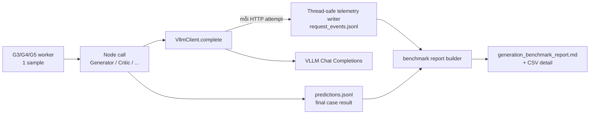

# Thiết kế telemetry benchmark cho G3–G5

## 1. Mục tiêu

Mentor cần một báo cáo đáng tin cậy về chi phí và số lần gọi model khi chạy generation. Thiết kế này thêm telemetry local để trả lời theo từng run, method, node và case:

1. Có bao nhiêu case được chạy / thành công / lỗi?
2. Có bao nhiêu **logical model call** theo thiết kế?
3. Có bao nhiêu **actual HTTP request** thực tế, bao gồm retry?
4. Provider đã tiêu thụ bao nhiêu input, output và total token nếu API trả `usage`?
5. Node nào gây nhiều request, retry, latency hoặc token nhất?

Phạm vi chỉ là G3, G4, G5 generation. Gemini evaluation, dashboard và Excel review không bị sửa bởi telemetry này.

## 2. Hai khái niệm bắt buộc phải tách

| Khái niệm | Định nghĩa | Ví dụ G4 Generator bị HTTP 429 rồi thành công |
|---|---|---|
| Logical model call | Một lần workflow quyết định gọi một node model | 1 Generator call |
| Actual HTTP request | Một lần `POST /v1/chat/completions` thật | 2 requests: attempt 1 = 429, attempt 2 = 200 |

`Actual HTTP request` là số dùng để báo tải thực tế lên VLLM. `Logical model call` giải thích cấu trúc workflow. Không dùng một số thay cho số còn lại.

OAuth token refresh là HTTP request riêng, nhưng **không** tính vào “model request” hoặc token usage. Report có thể hiển thị nó ở phụ lục vận hành nếu cần.

## 3. Luồng telemetry đã triển khai



Telemetry được ghi ngay sau mỗi HTTP response/error, không chờ cả case hoàn thành. Nếu process dừng giữa case, request đã gửi vẫn có event để audit.

## 4. Data contract: một event cho một HTTP attempt

Mỗi flow ghi file riêng: `output/telemetry/<run_id>/g3_request_events.jsonl`,
`g4_request_events.jsonl` hoặc `g5_request_events.jsonl`.

```json
{
  "schema_version": "1",
  "run_id": "g4_20260924T081500Z",
  "timestamp_utc": "2026-09-24T08:15:31.218Z",
  "method": "g4",
  "sample_id": "123",
  "stage": "generator",
  "logical_call_id": "g4:123:attempt-2:generator",
  "http_attempt": 1,
  "model_id": "v-llm-v1-medium",
  "has_image": true,
  "http_status": 200,
  "outcome": "success",
  "latency_ms": 1824.6,
  "input_tokens": 842,
  "output_tokens": 231,
  "total_tokens": 1073,
  "usage_available": true,
  "retry_reason": null
}
```

### 4.1. Field rules

| Field | Rule |
|---|---|
| `run_id` | Một ID do CLI tạo một lần cho cả run; không chứa credential. |
| `sample_id`, `method`, `stage` | Bắt buộc để group theo case và node. |
| `logical_call_id` | Stable trong một node invocation; các retry của cùng call giữ nguyên ID. |
| `http_attempt` | Đếm từ 1 trong phạm vi `logical_call_id`. |
| `outcome` | `success`, `http_error`, `transport_error`, hoặc `response_parse_error`. |
| `http_status` | Số HTTP nếu có response; ngược lại `null`. |
| `latency_ms` | Thời gian của riêng HTTP attempt, không gồm backoff sleep. |
| `*_tokens` | Lấy nguyên văn từ `response.usage`; `null` khi provider không trả usage. |
| `usage_available` | Cho report biết mẫu số token coverage. |
| `retry_reason` | Ví dụ `http_429`, `http_502`, `transport_error`; `null` ở attempt thành công đầu tiên. |

Event không được ghi prompt, Base64 image, bearer token, OAuth credential hoặc raw model response. Caption cũng không cần ghi lại vì đã có trong `predictions.jsonl`.

## 5. Context cần truyền vào VllmClient

`VllmClient.complete()` hiện chỉ biết `prompt`, `schema_name`, `schema`, `image`; nó không biết sample/method/stage. Thiết kế thêm một context explicit:

```python
CallContext(
    run_id=..., method="g4", sample_id="123",
    stage="generator", logical_call_id=...
)
```

Node wrapper truyền stage cố định, ví dụ:

| Flow | Stage telemetry |
|---|---|
| G3 | `observer_1`, `observer_2`, `observer_3`, `observer_4`, `consensus`, `caption`, `caption_vietnamese` |
| G4 | `generator`, `critic`, `verifier`, `caption_vietnamese` |
| G5 | `draft_annotation`, `verification_questions`, `image_answers`, `comparison`, `caption_vietnamese` |

CLI tạo `run_id`, worker tạo context sample-local và output writer là thread-safe. Không dùng global mutable “current sample”, vì `--workers > 1` sẽ làm lẫn context giữa ảnh.

## 6. Token extraction và missing usage

VLLM/OpenAI-compatible response có thể chứa `usage.prompt_tokens`, `usage.completion_tokens`, `usage.total_tokens`; nhưng contract server hiện tại chưa được xác nhận rằng các trường này luôn có.

Quy tắc:

1. Nếu đủ ba trường numeric: lưu đúng giá trị provider trả về.
2. Nếu provider trả một phần: lưu field có mặt, các field khác `null`.
3. Nếu không có `usage`: request vẫn được đếm, token report ghi `N/A` và token coverage giảm.
4. Không dùng tokenizer local để “ước lượng” trong report chính, vì image token accounting và tokenizer server chưa được xác nhận.

## 7. Cách ghi file và consistency

- Một `TelemetryWriter` sở hữu file JSONL của một CLI run.
- Mỗi worker gọi `writer.append(event)`; writer dùng `threading.Lock`, append một dòng, flush. `fsync` theo event là an toàn nhất nhưng có thể làm chậm run 2.000 case; mặc định đề xuất flush mỗi event và `fsync` khi worker hoàn thành case hoặc đóng run.
- Event không cần thứ tự theo `sample_id`; có `timestamp_utc` và `logical_call_id` để reconstruct.
- Không có database, queue, Redis, API service hoặc external observability vendor trong scope.

## 8. Benchmark report đề xuất

Lệnh mới sau implementation:

```bash
python tools/build_generation_benchmark_report.py \
  --telemetry-dir output/telemetry/<run_id> \
  --predictions output/g3/predictions.jsonl output/g4/predictions.jsonl output/g5/predictions.jsonl
```

Output:

```text
output/telemetry/<run_id>/generation_benchmark_report.md
output/telemetry/<run_id>/generation_benchmark_summary.csv
```

### 8.1. Bảng tổng quan cho mentor

| Metric | G3 | G4 | G5 |
|---|---:|---:|---:|
| Cases submitted |  |  |  |
| Cases success / error |  |  |  |
| Logical model calls |  |  |  |
| Actual HTTP requests |  |  |  |
| Retry requests |  |  |  |
| HTTP requests / successful case |  |  |  |
| Input tokens (provider reported) |  |  |  |
| Output tokens (provider reported) |  |  |  |
| Token coverage |  |  |  |
| P50 / P95 HTTP latency |  |  |  |

### 8.2. Bảng theo stage

| Method | Stage | Logical calls | HTTP requests | Retry rate | Total tokens | P50 latency | Error count |
|---|---|---:|---:|---:|---:|---:|---:|

### 8.3. Định nghĩa metric

- `retry requests = actual HTTP requests - logical model calls` chỉ khi mỗi logical call có ít nhất một event; report tính trực tiếp theo `http_attempt > 1` để tránh sai khi node fail sớm.
- `retry rate = retry requests / actual HTTP requests`.
- `HTTP requests / successful case = actual HTTP requests / số prediction status=success`.
- `token coverage = số actual requests có ít nhất một usage token / actual HTTP requests`.
- Tổng token chỉ là tổng các token provider thực sự báo. Không extrapolate phần thiếu.

## 9. Failure behavior

| Tình huống | Telemetry | Prediction JSONL | Benchmark report |
|---|---|---|---|
| HTTP 429 rồi thành công | Hai events cùng logical call ID | Case có thể success | 2 requests, 1 retry |
| Transport error hết retry | Event cho mỗi attempt | Case error | Count transport failure |
| HTTP 200 nhưng body JSON không parse | `response_parse_error` có token nếu usage tồn tại | Case error hoặc node validation retry (G5) | Request vẫn tính và token vẫn tính |
| Process bị dừng | Events đã flush còn lại | Có thể thiếu prediction row | Report tách “orphan request events” |
| Provider không trả usage | Event `usage_available=false` | Không đổi | Request count đúng; token `N/A`/coverage thấp |

## 10. Chi phí, riêng tư và vận hành

- Telemetry local không gửi thêm ảnh/caption ra ngoài VLLM, vì chỉ ghi metadata từ call hiện hữu.
- `sample_id` và model/stage là metadata vận hành; nếu ID nhạy cảm cần chính sách retention trước production (OQ-003 vẫn mở).
- 2.000 case có thể tạo nhiều event do retry/loop. JSONL append-only phù hợp vì event nhỏ và streaming; không cần database.
- Không tính giá tiền vì pricing/rate card VLLM chưa được cung cấp. Nếu mentor cần cost currency, phải có đơn giá input/output token và quy tắc image token từ provider (OQ-024).

## 11. Trạng thái implementation

Đã triển khai module telemetry độc lập trong cả ba package, truyền `CallContext`
từ pipeline tới client boundary, lưu `run_id` trong prediction JSONL và bổ sung
report builder Markdown/CSV. Mỗi dòng `predictions.jsonl` cũng có
`generation_metrics` để xem trực tiếp theo ảnh: `logical_call_count`,
`http_request_count`, `http_retry_count`, `input_tokens`, `output_tokens`,
`total_tokens` và `token_usage_coverage_percent`.

### Lệnh chạy benchmark cùng một run

Ba flow cần cùng `--run-id` để một report gộp được prediction và request của
cùng lần benchmark:

```bash
RUN_ID=benchmark_20260924

python -m g3_consensus_annotation --run-id "$RUN_ID" --workers 5
python -m g4_critic_verifier --run-id "$RUN_ID" --workers 5
python -m g5_qa_refinement --run-id "$RUN_ID" --workers 5

python tools/build_generation_benchmark_report.py \
  --telemetry-dir "output/telemetry/$RUN_ID" \
  --predictions output/g3/predictions.jsonl output/g4/predictions.jsonl output/g5/predictions.jsonl
```
4. Thêm report builder Python cùng unit tests với mocked HTTP usage/retry.
5. Không đổi prompt, schema annotation, G3/G4/G5 loop logic, hoặc output `predictions.jsonl` hiện tại.

## 12. Câu hỏi cần xác nhận

- Server VLLM có trả `usage.prompt_tokens`, `usage.completion_tokens`, `usage.total_tokens` không? Có thể xác nhận bằng một response mẫu đã xoá credential.
- Mentor có cần báo cáo OAuth request riêng không, hay chỉ model request?
- Khi nào cần money cost? Nếu cần, owner cần cung cấp price card/token accounting của endpoint.
