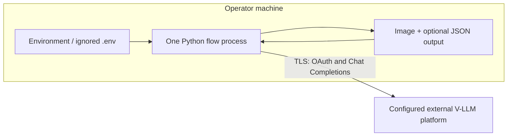

# Infrastructure

## Current deployment scope

These flows are local Python command-line programs. The repository does not deploy
the OAuth or V-LLM services and no cloud provider, region, availability target, or
runtime platform has been confirmed. The provider URL is configuration.

## Environments and configuration

There is one process-local runtime. Operators can use separate `.env` files for
development or production credentials via `--dotenv`; files must remain outside
version control. Each flow has a prefix (`G1_`…`G5_`) plus shared credential
fallbacks. No configuration service is needed.

## Network and security

- Outbound access is only to the configured service URL for OAuth and completions.
- Production should use HTTPS and platform-managed DNS/TLS; those controls are
  external to this repository.
- There is no inbound listener, public port, firewall rule, or administrative
  endpoint.
- Credentials are least-scoped by the external project/account; rotation is done
  by replacing environment values. The process never writes them.
- Local file access is governed by the operator's OS account; output permission is
  `0600`.

## Build, test, and release

Implementation will remain in the root Python project and update setuptools
package discovery/package data. A suitable local/CI sequence is dependency install,
Ruff, pytest with mocked HTTP, and package build. Real model calls are excluded
from automated verification (FR-012). Artifact provenance, approval workflow, and
package registry are not currently defined.

Rollout is a source/package update. Rollback is reinstalling the prior repository
revision; there are no migrations or persistent service state.

## Scaling, availability, and recovery

A single run is one process and one image. There is no autoscaling or background
worker. External provider latency/rate limits dominate. Local retry handles bounded
transient failures; terminal failures return non-zero and can be rerun manually.

No repository-managed backup or disaster recovery is required because the flows
own no database. Source control protects code; input and output backup remains the
operator's responsibility. Provider availability, RPO/RTO, multi-region behavior,
and batch capacity are outside current requirements.

## Observability

Optional stderr logs provide local diagnostic events. No centralized logs,
metrics, traces, dashboards, alerting, or SLO exists for a non-daemon CLI. If batch
or hosted execution is later introduced, required signals include per-stage
latency, call/error/retry counts, rate-limit responses, loop exhaustion, schema
validation failures, and cost-driving token/image sizes—without image or secret
payloads.

## Cost drivers and controls

Primary cost is external model calls: approximately 1, 3, 6, up to 9, and at least
4 calls for G1–G5 respectively depending on refinement. Bounded attempts and token
limits are the current controls. Prices, budgets, volume, concurrency, and latency
targets are unknown (OQ-004); no fabricated capacity plan is provided.

