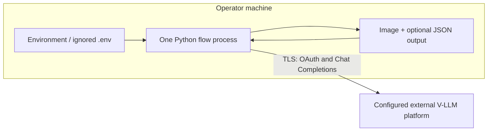

# Infrastructure

## Current deployment scope

These flows are local Python command-line programs. The repository does not deploy
the OAuth or V-LLM services and no cloud provider, region, availability target, or
runtime platform has been confirmed. The provider URL is configuration.

## Environments and configuration

There is one process-local runtime. Operators can use separate `.env` files for
development or production credentials via `--dotenv`; files must remain outside
version control. Each flow has a prefix (`G1_`…`G5_`) plus shared credential
fallbacks. No configuration service is needed.

## Network and security

- Outbound access is only to the configured service URL for OAuth and completions.
- Production should use HTTPS and platform-managed DNS/TLS; those controls are
  external to this repository.
- There is no inbound listener, public port, firewall rule, or administrative
  endpoint.
- Credentials are least-scoped by the external project/account; rotation is done
  by replacing environment values. The process never writes them.
- Local file access is governed by the operator's OS account; output permission is
  `0600`.

## Build, test, and release

Implementation will remain in the root Python project and update setuptools
package discovery/package data. A suitable local/CI sequence is dependency install,
Ruff, pytest with mocked HTTP, and package build. Real model calls are excluded
from automated verification (FR-012). Artifact provenance, approval workflow, and
package registry are not currently defined.

Rollout is a source/package update. Rollback is reinstalling the prior repository
revision; there are no migrations or persistent service state.

## Scaling, availability, and recovery

A single run is one process and one image. There is no autoscaling or background
worker. External provider latency/rate limits dominate. Local retry handles bounded
transient failures; terminal failures return non-zero and can be rerun manually.

No repository-managed backup or disaster recovery is required because the flows
own no database. Source control protects code; input and output backup remains the
operator's responsibility. Provider availability, RPO/RTO, multi-region behavior,
and batch capacity are outside current requirements.

## Observability

Optional stderr logs provide local diagnostic events. No centralized logs,
metrics, traces, dashboards, alerting, or SLO exists for a non-daemon CLI. If batch
or hosted execution is later introduced, required signals include per-stage
latency, call/error/retry counts, rate-limit responses, loop exhaustion, schema
validation failures, and cost-driving token/image sizes—without image or secret
payloads.

## Cost drivers and controls

Primary cost is external model calls: approximately 1, 3, 6, up to 9, and at least
4 calls for G1–G5 respectively depending on refinement. Bounded attempts and token
limits are the current controls. Prices, budgets, volume, concurrency, and latency
targets are unknown (OQ-004); no fabricated capacity plan is provided.

## Proposed review runtime

The review builder is one local Python process with no network or credential
dependency. It reads `sample/test` and `output/g#`, then writes only
`output/review/annotation_comparison.xlsx`; it embeds only source-relative image
paths, not copies of the images.

## Gemini evaluator runtime

The evaluator adds outbound TLS calls to Gemini. `GEMINI_API_KEY` comes from the
environment or ignored `.env`; Google recommends a restricted/auth key. The only
new dependency is `google-genai`; tests inject a fake transport and make no real
Gemini call. Gemini limits are per project and include request/token dimensions,
so workers are bounded and configuration exposes model, timeout, retry, and worker
count. The SDK retries transient errors, so the adapter must not create an
unbounded second retry loop. Quota and budget are OQ-009.

## Proposed local dashboard runtime

The dashboard adds one offline build step and one loopback browser session:

1. Run `python tools/build_dashboard_index.py` after the authoritative
   `captions_merged.csv` mapping changes.
2. Run `python tools/serve_dashboard.py`, a narrow server bound to `127.0.0.1`.
3. Open the dashboard in a local browser; it reads static assets, the generated
   index, and local image files only.

No new package, database, service account, credential, cloud resource, or outbound
network rule is required. The server intentionally exposes only `/dashboard/`, the
generated index, and `/sample/test/images/`; it does not serve the repository root
or `.env`. The builder reports invalid mapping/file references to stderr and exits
non-zero without writing a partial index. Browser console errors and visible UI
states are sufficient observability for this local-only scope.

## Proposed editable-review runtime

The narrow loopback process gains write permission only for
`output/dashboard/review_overrides.json` and the existing generated Excel output.
It reads `output/evaluation/reviews.jsonl` on demand, validates bounded JSON input,
writes overrides atomically, and runs the local Node exporter only when the
operator explicitly selects Export. It continues to deny repository-root files,
source TSV/JSONL, credentials, and external network paths.

There is no background queue, automatic export, cloud storage, browser-side
credential, or multi-user session. A failed save/export is reported in the browser
and leaves the previous artifact intact. Local process stderr logs endpoint, status,
and failure category but not captions, notes, images, or other payloads.

## V2 runtime and operations (proposed)

V2 reuses the existing local Python process, Gemini API-key configuration, bounded
worker pool, per-request timeout, and retry policy. It adds no cloud service, queue,
database, or browser credential. New v2 JSONL/overlay paths use existing atomic
write conventions; the old review artifact is retained for rollback/read-only
history. Logs expose only method, sample ID, status, latency, and redacted error
class. The operator owns quota, retry, timeout, and local disk retention settings.

No dashboard server, Node exporter, or browser asset is changed as part of the
evaluator-only v2 implementation.

### V2 consumer extension

The existing loopback dashboard process and local Node runtime are reused. Their v2
paths are limited to `reviews_v2.jsonl`, `review_overrides_v2.json`, and
`evaluation_review_v2.xlsx`; `.env`, v1 review artifacts, source outputs, and test
data remain blocked from browser serving/writes. Export has the existing bounded
subprocess timeout and preserves the last workbook if a new export fails.

### Isolated judge operations (proposed)

Each task normally makes two Gemini requests. Existing worker, timeout, and retry
settings bound the additional quota and latency; a worker runs caption then attribute
judging so per-task failure/output behavior stays deterministic.

### Two-branch v3 operations (approved)

Each worker will make two bounded Gemini requests in order: caption factuality then
caption-to-golden attribute match. Worker concurrency still applies across independent
samples; a worker writes its validated v3 row immediately when both calls complete.
This doubles the request count relative to the original v2 combined judge, so existing
timeout, retry, worker, quota, and cost configuration applies to each branch
independently. `reviews_v3.jsonl` and its v3 dashboard/export artifacts prevent
completed v2 rows from suppressing v3 work under `--resume`; without `--resume`, the
CLI deliberately starts a fresh v3 file.

The local Node exporter may create three method-specific v3 workbooks in one explicit
operator command. It is bounded by local disk and Node process limits; all inputs are
local JSONL/overlay data and no network or model call occurs.

The request-count formulas and worker/concurrency behavior for G3–G5 generation
are documented in [`g3_g5_flow_implementation_guide.md`](g3_g5_flow_implementation_guide.md).

## Local benchmark telemetry

The existing local process writes telemetry JSONL to its run directory; no external
collector, queue, database, Langfuse or LangSmith is required. A lock protects
concurrent worker append operations. This introduces local disk growth proportional
to HTTP attempts, while preserving retry/accounting evidence if a run terminates.
Token totals depend on provider `usage` availability (OQ-023); monetary cost needs
an approved price card (OQ-024). See
[`generation_benchmark_telemetry_design.md`](generation_benchmark_telemetry_design.md).
