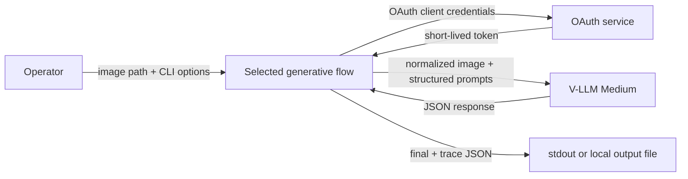
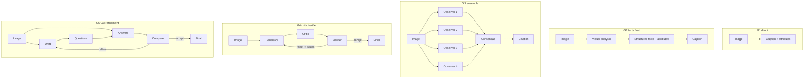
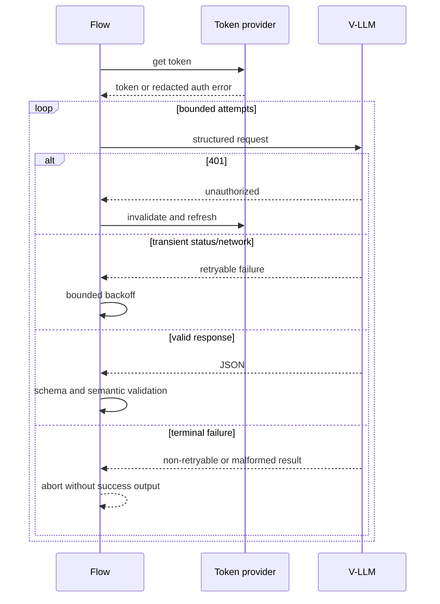

# System architecture

## Drivers and constraints

- Five inspectable alternatives must remain isolated and directly runnable
  (FR-001, FR-009).
- Every final result must satisfy the same caption and 21-attribute contract
  (FR-002, BR-002–005).
- Provider access must preserve C1's security and failure behavior
  (FR-008, FR-010–012, NFR-003–006).
- This phase deliberately excludes evaluation infrastructure and distributed
  execution (NFR-007, BR-009).

## System context and trust boundaries

The process boundary separates local source images, credentials, and outputs from
the external OAuth/V-LLM service. No image or annotation is persisted elsewhere by
these packages.

## Components

| Component | Responsibility | Requirement |
|---|---|---|
| Flow CLI | Parse paths/non-secret overrides, coordinate stages, format exit | FR-001, FR-011 |
| Settings | Resolve flow-prefixed config and C1-compatible shared credentials | FR-008, BR-001 |
| Image adapter | Validate and normalize to a bounded JPEG data URL | FR-008 |
| OAuth token provider | Cache/refresh bearer token | FR-008, BR-007 |
| Chat client | Build/send structured Chat Completions and retry transient failures | FR-008, FR-010 |
| Taxonomy | Load schema, build JSON Schema, validate all attributes | FR-002, BR-002–004 |
| Flow orchestrator | Execute only the selected topology and enforce loop bounds | FR-003–007, BR-008 |
| Output adapter | Serialize final/trace data and write atomically | FR-009, FR-011 |

## Five synchronous flows

All orchestration is synchronous. G3's four observers are executed sequentially
in the simplest implementation so token reuse, retries, and traces remain obvious;
parallel calls can be added later without changing contracts. Prompts give the
four observers distinct evidence focuses rather than assuming provider seed
support.

G2's visual analysis sees the image. The structured-facts stage receives the image
and analysis, and produces canonical facts plus attributes. The final caption
stage receives facts only, preventing it from inventing a new visual claim.

G4's critic and verifier both see the image and current draft. Rejection issues are
fed to the next generator attempt. G5's answer stage sees the image and generated
questions; the comparator consumes draft/Q&A and returns either accept or a fully
valid replacement annotation. These decision stages are generative safeguards,
not benchmark evaluation (BR-009).

## Failure sequence

## Consistency and idempotency

There is no shared state or transaction. A run is isolated in memory. Re-running
can produce a different model response and is therefore not semantically
idempotent, but cannot corrupt a prior output because replacement is atomic.
Stage order and attempt indices are recorded in the trace.

## Scaling and bottlenecks

The external model dominates latency and cost. Expected successful call counts are
G1=1, G2=3, G3=6, G4=3 per accepted first attempt (up to 9 at the proposed maximum),
and G5=4 per first-round acceptance (plus bounded refinement calls). No throughput,
latency, or cost target is known (OQ-004). A batch/concurrency layer is intentionally
deferred.

## Security and privacy

- Credentials are loaded from environment/ignored `.env` and never accepted as a
  secret CLI flag.
- External requests use the configured HTTPS URL in production; allowing HTTP is
  retained for local compatibility but should be explicitly chosen.
- Errors contain status codes and stage names, not provider bodies or secrets.
- Full Base64 images are never logged.
- Provider governance and retention remain an operator responsibility (OQ-003).

## Observability and operations

Default output is machine-readable JSON only. With `--verbose`, stderr records
flow/stage name, attempt number, retry status, and completion/failure; it omits
prompt bodies, image data, credentials, token, and raw provider body. There is no
metrics backend, alerting, or always-on operational owner in this local CLI scope.

## Deliberately avoided complexity

No LangGraph, REST server, database, Redis, queue, scheduler, cache, microservice,
or evaluation subsystem is proposed. Plain Python orchestrators are sufficient for
five bounded synchronous pipelines (ADR-002).

Relevant decisions: ADR-001 through ADR-006 in `docs/decisions.md`.

