# System architecture

## Drivers and constraints

- Five inspectable alternatives must remain isolated and directly runnable
  (FR-001, FR-009).
- Every final result must satisfy the same caption and 21-attribute contract
  (FR-002, BR-002–005).
- Provider access must preserve C1's security and failure behavior
  (FR-008, FR-010–012, NFR-003–006).
- This phase deliberately excludes evaluation infrastructure and distributed
  execution (NFR-007, BR-009).

## System context and trust boundaries

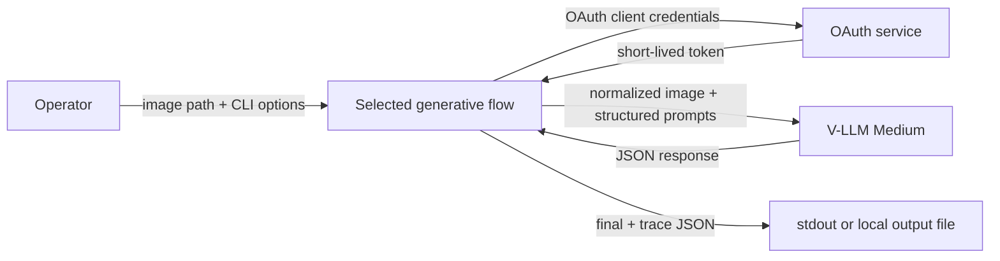

The process boundary separates local source images, credentials, and outputs from
the external OAuth/V-LLM service. No image or annotation is persisted elsewhere by
these packages.

## Components

| Component | Responsibility | Requirement |
|---|---|---|
| Flow CLI | Parse paths/non-secret overrides, coordinate stages, format exit | FR-001, FR-011 |
| Settings | Resolve flow-prefixed config and C1-compatible shared credentials | FR-008, BR-001 |
| Image adapter | Validate and normalize to a bounded JPEG data URL | FR-008 |
| OAuth token provider | Cache/refresh bearer token | FR-008, BR-007 |
| Chat client | Build/send structured Chat Completions and retry transient failures | FR-008, FR-010 |
| Taxonomy | Load schema, build JSON Schema, validate all attributes | FR-002, BR-002–004 |
| Flow orchestrator | Execute only the selected topology and enforce loop bounds | FR-003–007, BR-008 |
| Output adapter | Serialize final/trace data and write atomically | FR-009, FR-011 |

## Five synchronous flows

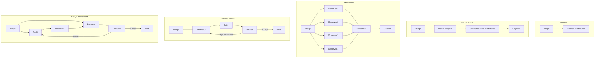

All orchestration is synchronous. G3's four observers are executed sequentially
in the simplest implementation so token reuse, retries, and traces remain obvious;
parallel calls can be added later without changing contracts. Prompts give the
four observers distinct evidence focuses rather than assuming provider seed
support.

G2's visual analysis sees the image. The structured-facts stage receives the image
and analysis, and produces canonical facts plus attributes. The final caption
stage receives facts only, preventing it from inventing a new visual claim.

G4's critic and verifier both see the image and current draft. Rejection issues are
fed to the next generator attempt. G5's answer stage sees the image and generated
questions; the comparator consumes draft/Q&A and returns either accept or a fully
valid replacement annotation. These decision stages are generative safeguards,
not benchmark evaluation (BR-009).

## Failure sequence

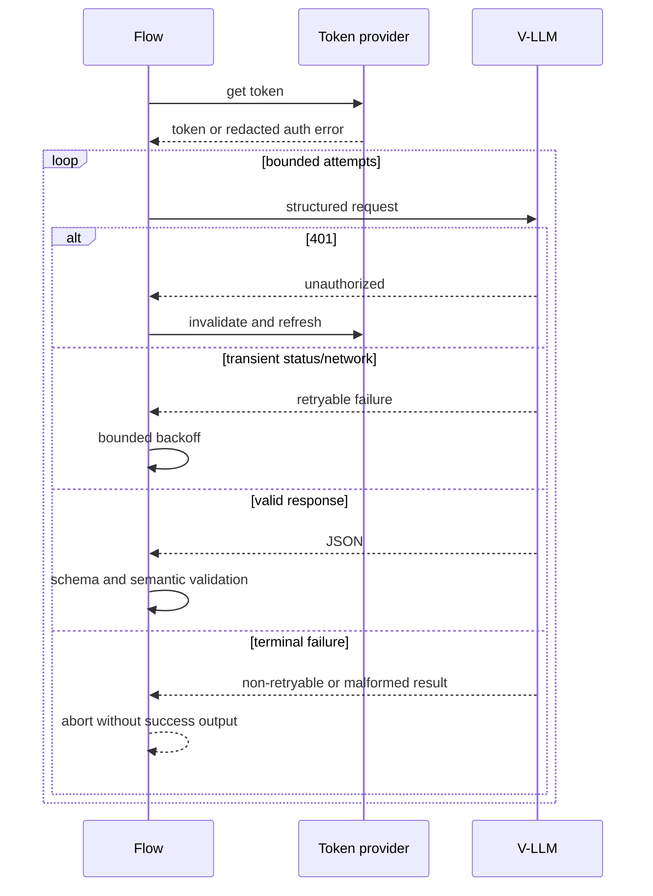

## Consistency and idempotency

There is no shared state or transaction. A run is isolated in memory. Re-running
can produce a different model response and is therefore not semantically
idempotent, but cannot corrupt a prior output because replacement is atomic.
Stage order and attempt indices are recorded in the trace.

## Scaling and bottlenecks

The external model dominates latency and cost. Expected successful call counts are
G1=1, G2=3, G3=6, G4=3 per accepted first attempt (up to 9 at the proposed maximum),
and G5=4 per first-round acceptance (plus bounded refinement calls). No throughput,
latency, or cost target is known (OQ-004). A batch/concurrency layer is intentionally
deferred.

## Security and privacy

- Credentials are loaded from environment/ignored `.env` and never accepted as a
  secret CLI flag.
- External requests use the configured HTTPS URL in production; allowing HTTP is
  retained for local compatibility but should be explicitly chosen.
- Errors contain status codes and stage names, not provider bodies or secrets.
- Full Base64 images are never logged.
- Provider governance and retention remain an operator responsibility (OQ-003).

## Observability and operations

Default output is machine-readable JSON only. With `--verbose`, stderr records
flow/stage name, attempt number, retry status, and completion/failure; it omits
prompt bodies, image data, credentials, token, and raw provider body. There is no
metrics backend, alerting, or always-on operational owner in this local CLI scope.

## Deliberately avoided complexity

No LangGraph, REST server, database, Redis, queue, scheduler, cache, microservice,
or evaluation subsystem is proposed. Plain Python orchestrators are sufficient for
five bounded synchronous pipelines (ADR-002).

Relevant decisions: ADR-001 through ADR-006 in `docs/decisions.md`.

## Proposed review workspace

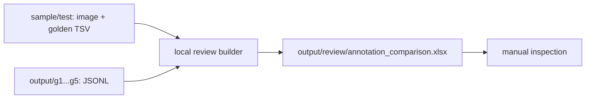

The builder is synchronous and read-only. It joins by `sample_id`, appends a
column group for each available flow, and displays missing/malformed output as a
local state rather than an evaluation. No database, server, queue, cache, or AI
call is added.

## Gemini evaluation extension

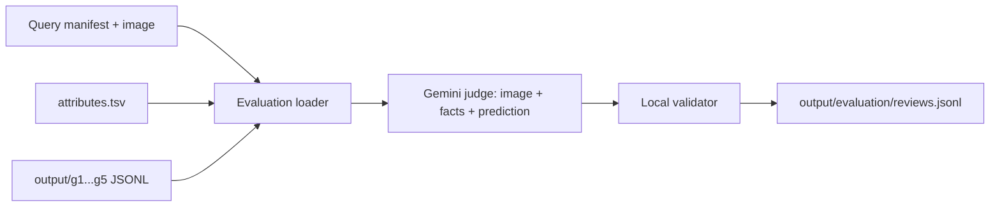

The local evaluator resolves one query image, then makes one stateless Gemini
request for one `(sample_id, method)`. Gemini returns a caption verdict plus 21
attribute verdicts. A single main writer flushes each validated JSONL row; terminal
per-sample failures become redacted error rows and do not stop other samples. No
queue, database, server, cache, or automatic correction is proposed.

## Proposed local image-lookup dashboard

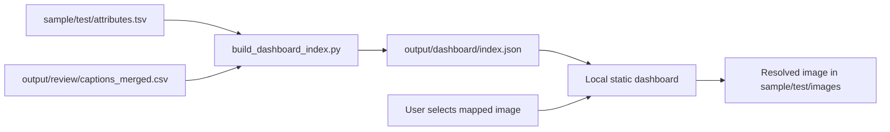

The index builder is an offline validation boundary. It joins `person_key` to
`person_id` in `attributes.tsv`, treats that person ID as `sample_id`, and joins it
to the existing exact `image_path` mapping. It fails closed on ambiguity or a
missing file. The browser only reads the generated index and the selected local
image; it contains no dataset-writing, model, Gemini, or credential path.

Happy path: start the narrow loopback-only dashboard server; it exposes only the
dashboard assets, `index.json`, and test-image paths. The browser renders mapped
image cards; the operator selects one; the UI uses its exact mapped identity and
renders the image. Failure path: unavailable/stale index or image-load failure
renders a message and no unrelated image. The dashboard does not guess mappings.

## Proposed editable evaluation review extension

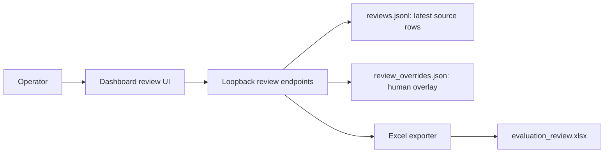

The same narrow loopback server gains three bounded responsibilities: read a latest
evaluation by exact `(sample_id, method)`; atomically validate and store human
overrides; and trigger the existing local Excel exporter after overrides have been
saved. The browser never writes the source JSONL/TSV/XLSX files itself.

Happy path: lookup key → select available method → view source values → enter human
override fields → save an overlay → request Excel export → download the regenerated
workbook. If an evaluation does not exist, the UI retains the image and shows no
editor. A malformed save, unknown field/method, write failure, or exporter failure
does not alter a prior override or source data and returns an actionable local error.

## AI Harness evaluation v2 (proposed)

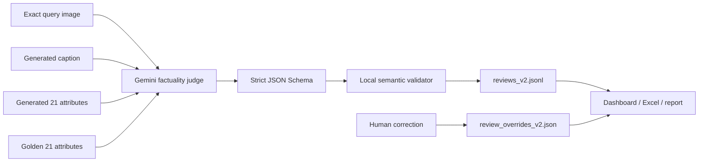

One exact task remains one stateless Gemini call. Caption checks cover all 21 fields
and a bounded unmapped-claim list so a false person count or invented object cannot
evade review. The local validator enforces the boolean/null truth table, then the
single writer flushes each completed v2 row. Per-task error rows are redacted and do
not block workers. There is no automatic correction, acceptance threshold, or model
feedback into G1–G5. Accuracy excludes null; coverage is displayed but cannot turn a
factual caption into failure.

This implementation boundary stops at `reviews_v2.jsonl`. Dashboard, workbook, and
report boxes are future consumers only and will not be modified in this change.

## V2 dashboard and Excel consumers (proposed)

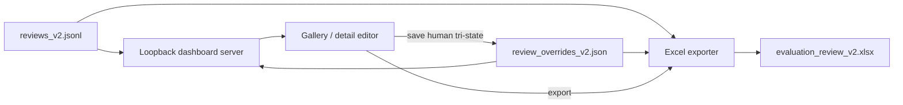

The server retains exact image mapping and loopback-only access. Its review endpoint
reads only the latest v2 row and an optional v2 overlay. The exporter reads the same
two files directly, so browser state never becomes a source of truth. Save uses a
whole-file atomic overlay replacement; export creates a new v2 workbook without
rewriting v1 artifacts. Missing v2 review, invalid override, failed save, and failed
export are explicit UI errors.

## Caption/attribute judge isolation (proposed)

```mermaid
flowchart LR
  I["Query image"] --> C["Caption judge"]
  T["Generated English caption"] --> C
  I --> A["Attribute judge"]
  P["Generated 21 attributes"] --> A
  G["Golden 21 attributes"] --> A
  C --> V["Local validators"]
  A --> V
  V --> R["One v2 review row"]
```

Two independent Gemini calls are combined only after local validation. Caption
context never contains attributes or golden labels. A failure in either stage yields
one redacted task error row; no partial success is published.

## Two-branch evaluation v3 (approved)

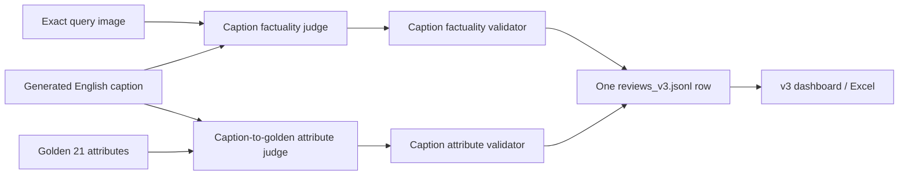

The two calls deliberately answer different questions. Caption factuality has only
visual evidence; caption attribute checks have only text and the frozen taxonomy
reference. Generated structured attributes remain preserved prediction provenance but
are not evaluated. The pipeline invokes the two calls sequentially inside one task
worker, validates both locally, then flushes one completed row. A branch failure
produces one redacted error row rather than a partial review.

## Per-method Excel export v3 (approved)

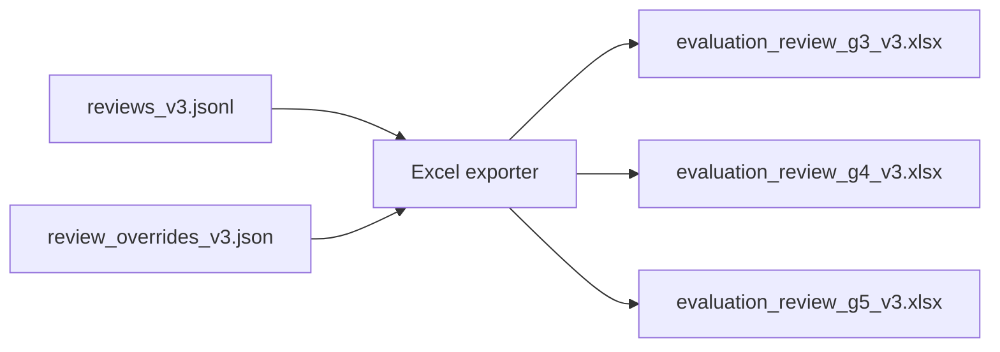

Each workbook filters to exactly one method. It contains a caption summary sheet
and a per-attribute sheet; the latter preserves all 21 checks and their tri-state
verdicts for every evaluated sample.

## G3–G5 execution reference

For exact node sequencing and evidence flow inside the independent G3, G4, and G5
generators, see [`g3_g5_flow_implementation_guide.md`](g3_g5_flow_implementation_guide.md).
That document is an observed-code reference; it does not alter the architecture
requirements in this document.

## Per-case generation counters

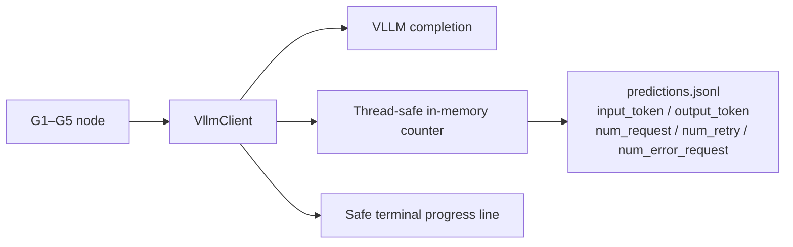

Each flow holds a thread-safe in-memory counter for the active case (FR-048–051).
The VLLM client increments `num_request` for every model HTTP attempt, including a
retry; tracks retries in `num_retry`; tracks failed HTTP, transport, or response-parse
attempts in `num_error_request`; and adds provider-reported input/output usage when
available. When the case finishes, its five aggregate fields are attached to the final
prediction JSONL row.
The client prints a safe progress line to the terminal; no per-request log file is
written. This deliberately avoids a queue, database and third-party observability
service.

Before each VLLM model HTTP attempt, the one client shared by all workers applies a
thread-safe rolling 60-second limiter from `VLLM_MAX_REQUESTS_PER_MINUTE` (FR-052).
It waits for capacity rather than dropping or reordering a case.
