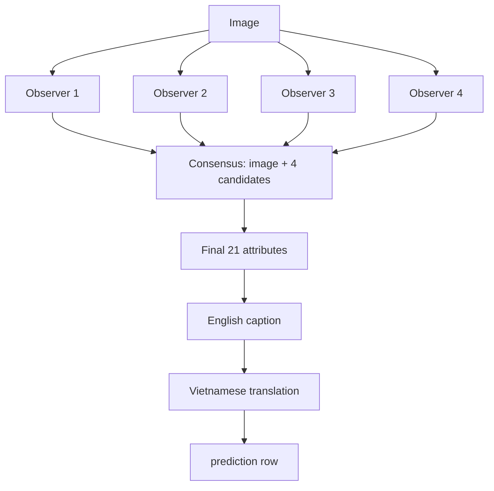

# G3 — Four-observer attribute consensus

G3 creates an English caption, Vietnamese caption, and 21 taxonomy attributes for
each query image. Four independent observer calls inspect the image before a separate
consensus call chooses the final attributes. G3 is independent of other flows and
does not use an evaluator, database, LangGraph, or LangChain.

## Input and output

`--test-dir` (default `sample/test`) needs `pairs_en_medium.tsv`, `attributes.tsv`,
and all images referenced by query rows. Only rows with `is_query=1` run.
`person_id` becomes `sample_id` and `filepath` identifies the image. Attributes TSV
validates input mapping only; golden labels are never put in a model prompt.

Each completed case is appended, flushed, and fsynced to:

```text
output/g3/predictions.jsonl
```

With multiple workers, JSONL order is completion order. Match images using
`sample_id`, never the line number.

## Flow



| Stage | Model input | Required result | Persisted? |
|---|---|---|---|
| `observer_1`…`observer_4` | Image + observer instruction | Draft caption + 21 attributes | No, intermediate evidence |
| `consensus` | Image + all four drafts | Final 21 attributes | Yes |
| `caption` | Final attributes, no image | English factual caption | Yes |
| `caption_vietnamese` | English caption, no image | Vietnamese caption | Yes |

Without retries, G3 makes **7 model requests**: four observers, consensus, caption,
and translation. Only final captions and consensus attributes enter prediction JSONL.

## JSON, retry, and error behavior

Every node requests JSON Schema output; final attributes also pass local taxonomy
validation. Retryable HTTP/network errors use `VLLM_MAX_RETRIES`. A final HTTP error,
malformed model JSON, or invalid taxonomy result produces `status="error"`; that row
is still written immediately with counters and an error object.

## Terminal logs and per-case metrics

Every VLLM HTTP attempt prints:

```text
[g3] sample=42 stage=consensus request=5 outcome=success input_token=680 output_token=90
```

When the image ends, its prediction row has top-level fields:

```json
{"input_token":680,"output_token":90,"num_request":7,"num_retry":0,"num_error_request":0}
```

- `input_token`, `output_token`: provider `usage` sums; `null` if unavailable.
- `num_request`: all VLLM model HTTP attempts for this image.
- `num_retry`: attempts after a first attempt of a logical node call.
- `num_error_request`: failed HTTP, transport, or malformed-response attempts.

OAuth refresh calls are excluded. No request-event log file is written.

## Running and concurrency

```bash
source .venv/bin/activate
python -m g3_consensus_annotation --workers 3 --max-retries 3
```

Workers run images in parallel; an image's nodes remain sequential because each next
node needs earlier output. Terminal lines may interleave, but every line has
`sample=...` and every case owns separate counters.

```bash
python -m g3_consensus_annotation \
  --test-dir /path/to/test --output-dir output/g3 \
  --model v-llm-v1-medium --workers 3 --max-tokens 1024 --max-retries 3
```

Root `.env` provides VLLM/OAuth settings. Use `G3_MODEL` or `--model` for G3.
