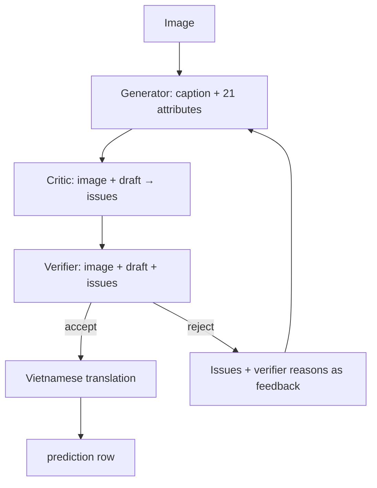

# G4 — Generator, critic, verifier loop

G4 creates a person annotation, critiques it against the image, then has a verifier
accept or reject it. On rejection, structured issues become feedback for a new
generator round. It is independent of other flows and uses no evaluator, database,
LangGraph, or LangChain.

## Input and output

The default `sample/test` requires `pairs_en_medium.tsv`, `attributes.tsv`, and
referenced images. Only query rows (`is_query=1`) run. Attribute labels only validate
the person/image mapping and never enter generator, critic, or verifier prompts.

Each case finishes as one row in:

```text
output/g4/predictions.jsonl
```

With concurrent workers, JSONL is completion-ordered. Use `sample_id` to match the
row to an image.

## Flow and data movement



| Stage | Model input | Required JSON | Role |
|---|---|---|---|
| `generator` | Image + prior feedback, if any | Caption + 21 attributes | Candidate annotation |
| `critic` | Image + candidate | `{"issues":[...]}` | False, contradictory, or taxonomy-invalid claims; empty list is valid |
| `verifier` | Image + candidate + issues | `{"decision":"accept"|"reject","reasons":[...]}` | Finish or regenerate |
| `caption_vietnamese` | English caption only | `{"caption_vi":"..."}` | Final Vietnamese caption |

Caption omission alone is not a critic issue when every stated caption fact is
supported. Critic issues and verifier reasons are intermediate data. Final JSONL keeps captions,
attributes, `workflow_status`, and `workflow_notes`.

## Loop behavior

`--max-attempts` limits generator/critic/verifier rounds; default is 20.

- First-round accept normally uses 4 requests: generator, critic, verifier,
  translation.
- Reject sends critic issues and verifier reasons to the next generator round.
- At the limit, G4 translates and writes the last draft with
  `workflow_status="rejected_after_max_attempts"`. The workflow completed, but the
  verifier did not accept its final draft.

## JSON and transport retry

Every call uses provider JSON Schema plus local validation. Schema mode is not
absolute: malformed JSON is retried at the same node up to `VLLM_MAX_RETRIES`
(default 3), as are retryable HTTP/network failures.

For a critic that returns prose or malformed JSON:

1. The attempt is counted as `response_parse_error`.
2. G4 retries `critic`.
3. A valid retry continues the round.
4. Exhausted retries write `status="error"` with `error.code="critic"`.

The critic prompt explicitly allows an empty result as `{"issues":[]}` and forbids
Markdown or text outside JSON.

## Terminal logs and per-case counters

```text
[g4] sample=7 stage=critic request=2 outcome=response_parse_error input_token=340 output_token=80
```

Final output includes:

```json
{"input_token":3817,"output_token":2122,"num_request":8,"num_retry":1,"num_error_request":1}
```

`num_request` counts every VLLM HTTP attempt. `num_retry` counts attempts after a
first node attempt. `num_error_request` counts HTTP, transport, or JSON failures.
Token fields are provider `usage` sums, or `null` when usage is missing. OAuth is
excluded and no request-event file is created.

## Run and concurrency

```bash
source .venv/bin/activate
python -m g4_critic_verifier --workers 3 --max-attempts 20 --max-retries 3
```

Workers process independent images in parallel while each case's nodes stay
sequential. Log lines may interleave but have `sample=...`; each completed row is
appended, flushed, and fsynced immediately.

```bash
python -m g4_critic_verifier \
  --test-dir /path/to/test --output-dir output/g4 \
  --model v-llm-v1-medium --workers 3 --max-attempts 20 --max-retries 5
```

Root `.env` supplies VLLM/OAuth configuration. Use `G4_MODEL` or `--model` for G4.
