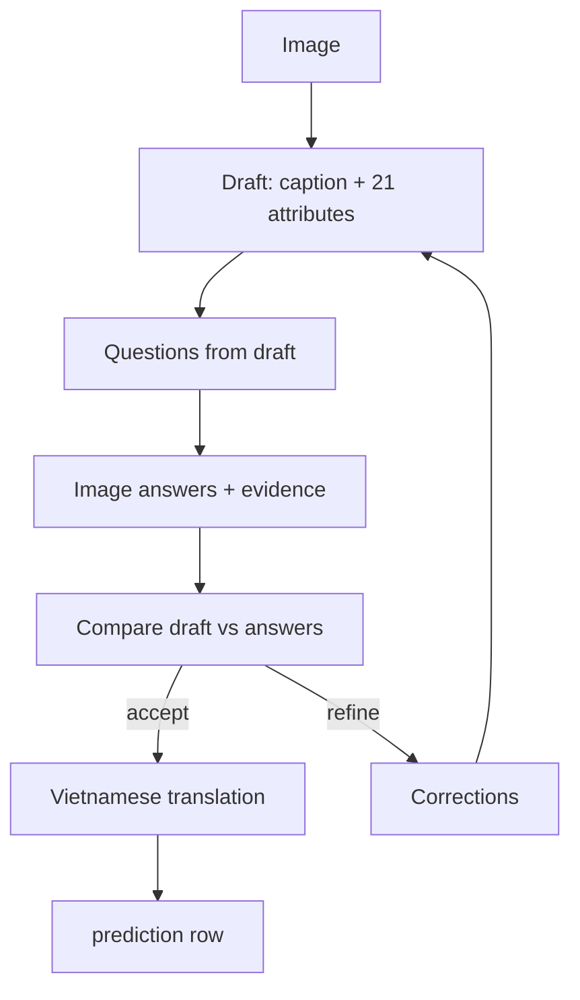

# G5 — Question-answer visual refinement

G5 verifies its own draft through questions. It creates caption/attributes, turns
the draft into verification questions, answers those questions from the image, then
compares answers with the draft. A `refine` decision starts another draft round. G5
is independent of other flows and has no evaluator, database, LangGraph, or
LangChain dependency.

## Input and output

Default input `sample/test` must contain `pairs_en_medium.tsv`, `attributes.tsv`,
and referenced images. Only `is_query=1` rows are processed. Golden attributes only
validate input mapping; the model never receives them.

One completed case is written to:

```text
output/g5/predictions.jsonl
```

Rows can be completion-ordered with multiple workers. Use `sample_id` as the stable
image key.

## Flow and data movement



| Stage | Model input | Required result | Persisted? |
|---|---|---|---|
| `draft_annotation` | Image + prior corrections | Caption + 21 attributes | Final draft only |
| `verification_questions` | Draft only | Question ID, target, question | No |
| `image_answers` | Image + questions | Answer, visual evidence, determinable flag per ID | No |
| `comparison` | Draft + answers | `accept`/`refine` + corrections | Workflow state only |
| `caption_vietnamese` | Final English caption | Vietnamese caption | Yes |

Questions and image answers are intermediate memory. They are not emitted in final
JSONL, keeping output compact while still grounding refinement in the image.

## Refinement and validation

`--max-refinements` is the number of permitted `refine` transitions, default 20.
G5 can therefore run at most **21 draft rounds**: the initial round plus 20 refined
rounds.

- `accept`: translate and write the current draft.
- `refine`: corrections become input to the next draft prompt.
- Limit reached: translate and write the last draft with
  `workflow_status="refine_limit_reached"` and final corrections.

Each structured node also has local validation. If schema-valid JSON fails stricter
local checks, such as a missing answer for a question ID, G5 reissues that node once.
`VLLM_MAX_RETRIES` separately handles retryable HTTP/network and malformed JSON
responses inside one VLLM call.

First-round acceptance normally takes 5 requests: draft, questions, answers,
comparison, translation. Refinement rounds and local validation reissues can make the
total much larger.

## Terminal logging and counters

```text
[g5] sample=19 stage=image_answers request=3 outcome=success input_token=520 output_token=120
```

At case completion the row contains:

```json
{"input_token":2100,"output_token":650,"num_request":5,"num_retry":0,"num_error_request":0}
```

- `num_request`: all VLLM model HTTP attempts for the image.
- `num_retry`: attempts after a first attempt for a logical call.
- `num_error_request`: failed HTTP, transport, or JSON attempts.
- `input_token`, `output_token`: provider-reported sums; `null` if usage is absent.

OAuth refresh is excluded and no request-event log file is created.

## Run and concurrency

```bash
source .venv/bin/activate
python -m g5_qa_refinement --workers 2 --max-refinements 20 --max-retries 3
```

Different images run concurrently; nodes in one image remain sequential. Terminal
lines can interleave but each includes `sample=...`. A completed prediction is
appended, flushed, and fsynced immediately.

```bash
python -m g5_qa_refinement \
  --test-dir /path/to/test --output-dir output/g5 \
  --model v-llm-v1-medium --workers 2 \
  --max-refinements 20 --max-retries 5
```

Root `.env` provides OAuth and common VLLM settings. Use `G5_MODEL` or `--model`.
